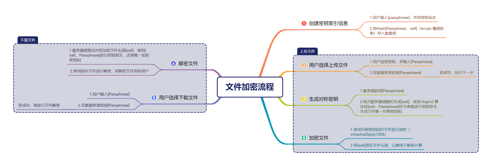
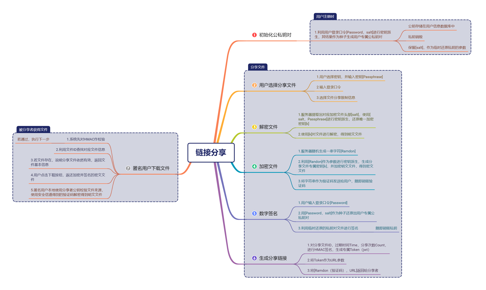

# 实验报告

## 主要贡献

### 设计阶段

1. 参与前期技术选型，撰写开发规范文件
2. 参与项目的需求分析以及功能划分，划定网盘预期实现的功能点
3. 前端界面 UI 选型
4. 参与密码学设计：用户存储信息的数据库、文件加密流程、找回密码功能、分享链接功能、密钥管理，文件散列值信息，数字签名等

### 代码实现

1. 找回密码功能前端，后端
2. 散列值下载前端，后端
3. 文件秒传前端，部分后端
4. 链接分享前端，部分后端（不包括具体加解密代码）
5. 所有前端的用户提示报错信息

------

## 重点密码学设计

### 文件加密流程

#### 设计思想

本项目始终坚持明文口令、密钥、文件等不存在于服务器任何地方，所以文件加密时我们设计每次用户上传文件必须输入口令还原出明文文件，然后下载，同时我们提供了 MD5 和 Sha256 散列值供用户本地校验文件完整性。为了防止用户某一密钥口令泄露导致用相应密钥加密的文件处于不安全状态，我们为用户提供了密钥管理功能，用户可以创建不同的密钥加密文件。用户也可能用同一口令生成不同密钥，于是我们为口令附加盐值，便可生成不同密钥，提升安全性。

用户每次下载文件时，由于密钥不存在于任何地方，所以需要用户输入相应密钥口令，临时还原出对称密钥解密文件，提供下载。

### 链接分享流程

#### 设计思想

链接分享功能是我重点讨论设计的功能，包含密码学知识有数字签名，对称加密，密钥管理，散列值校验等。因为用户的文件都是通过自己设置的密钥加密的，但是密钥也不能让被分享者拿到，于是需要先解密，再分享给他人。其中为了满足服务器上不存储明文文件的要求，于是随机生成的验证码就可当作此次分享文件的“会话密钥”对文件进行对称加密。被分享者通过安全信道拿到验证码后就可以本地解密得到明文文件。为了验证分享者的分身，分享者在用对称密钥加密文件后还需对文件进行签名，以方便被分享者拿到文件后作本地签名验证。同时为了方便被分享者做文件完整性验证，我们实际是将对称加密后的文件与散列值合并后进行签名。

#### 代码实现问题

由于存储在服务器端的文件加密密钥和分享文件的加密密钥不一样，所以我选择新生成一个数据库，专门存储用于分享的加密文件，存储在这个库里的文件都是加密并签名的文件，这样就可以在数据库层面将两种文件分开存储，并生成随机 file id 用于查找文件。

 功能前端实现了很多方便用户的功能，比如错误提示，选择分享次数，选择文件，直接帮用户复制验证码和分享链接等。

验证文件分享次数，每次有用户访问下载资源，在数据库的 count 字段数减1，减到 0 会直接删除资源；同理于分线限制时间验证。

### 找回密码

#### 设计思想

由于没有密码服务器，我选择了注册一个网易邮箱作为我们的邮箱服务器，用来发送验证码功能。用户找回密码的时候需要输入注册邮箱来接收验证码。服务器验证验证码的正确性后即可开放密码修改的权限。