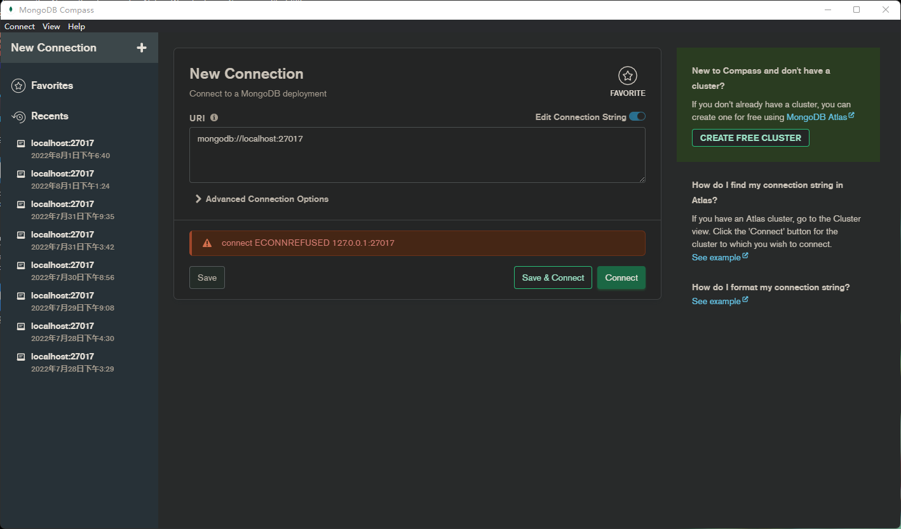
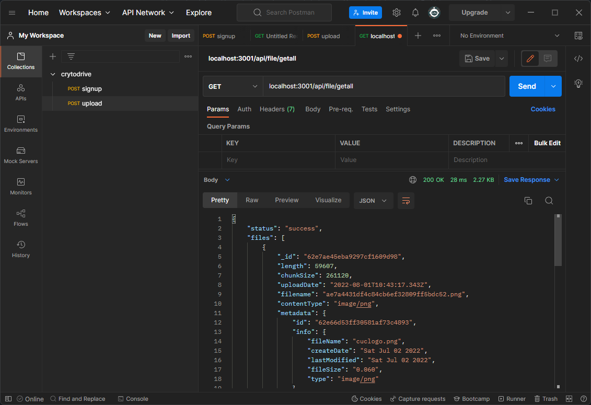
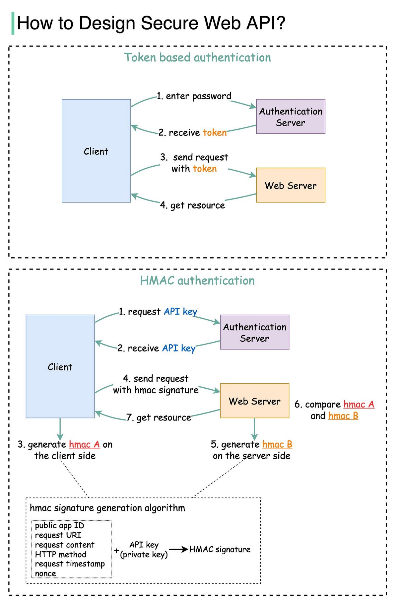

## MERN Stack


---

- MongoDB(Mongoose)
- Express.js
- React.js
- Node.js

---

## WSL2中安装MongoDB

```bash
# 1. Open your WSL terminal (ie. Ubuntu) and go to your home directory: 
cd ~
# 2. Update your Ubuntu packages: 
sudo apt update
#3.  Import the public key used by the MongoDB package management system: 
wget -qO - https://www.mongodb.org/static/pgp/server-5.0.asc | sudo apt-key add -
#4.  Create a list file for MongoDB: 
echo "deb [ arch=amd64,arm64 ] https://repo.mongodb.org/apt/ubuntu focal/mongodb-org/5.0 multiverse" | sudo tee /etc/apt/sources.list.d/mongodb-org-5.0.list
#5.  Reload local package database: 
sudo apt-get update
#6.  Install MongoDB packages: 
sudo apt-get install -y mongodb-org
#7.  Confirm installation and get the version number: 
mongod --version
#8.  Make a directory to store data: 
mkdir -p ~/data/db
#9.  Run a Mongo instance: 
sudo mongod --dbpath ~/data/db
#10.  Check to see that your MongoDB instance is running with: 
ps -e | grep 'mongod'
#11.  To exit the MongoDB Shell, use the shortcut keys: Ctrl + C
```

---

## WSL2中开启MongoDB服务

- 由于WSL2不支持systemctl，所以开启服务的方法有些tricky。
  
  ```bash
  #1.  Download the init.d script for MongoDB: 
  curl https://raw.githubusercontent.com/mongodb/mongo/master/debian/init.d | sudo tee /etc/init.d/mongodb >/dev/null
  #2.  Assign that script executable permissions: 
  sudo chmod +x /etc/init.d/mongodb
  #3.  Now you can use MongoDB service commands:
    sudo service mongodb status 
    #for checking the status of your database. You should see a [Fail] response if no database is running.
    sudo service mongodb start 
    #to start running your database. You should see a [Ok] response.
    sudo service mongodb stop 
    #to stop running your database.
  ```

---

## 使用MongoDB Compass获得图形化界面



---

## 安装nodejs

- 推荐使用NVM来管理nodejs以及NPM的版本
  
  ```bash
  sudo apt-get install curl
  curl -o- https://raw.githubusercontent.com/nvm-sh/nvm/v0.39.1/install.sh | bash
  nvm install --lts
  node --version
  npm --version
  nvm use --lts
  ```

---

## 使用Postman调试后端API



---

## 运行前端

- 默认会在3000端口打开服务
  
  ```bash
  npm install 
  npm start
  ```

---

## 运行后端

- 修改`config.env`文件参数
  
  ```bash
  NODE_ENV=development
  ```

PORT=3001

DATABASE_LOCAL=mongodb://localhost:27017/yourdatabasename

JWT_SECRET=my-ultra-secure-and-ultra-long-secret

JWT_EXPIRES_IN=90d

JWT_COOKIE_EXPIRES_IN=90

```
---
## 运行后端
```bash
npm install
npm start # production
npm run dev # development
```

---

## 目前完成的情况

- [x] 前端demo
- [x] 后端认证API
- [x] 部分上传API

---

## 认证架构



---

## 数据库设计

- Parent Child Relationship
  