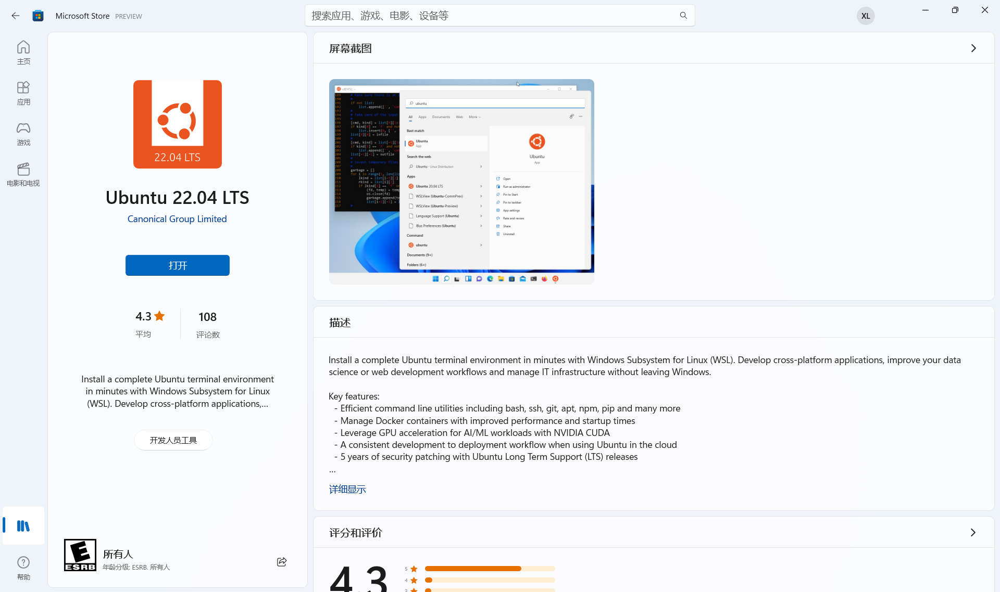

# 开发环境规范文件


## 使用 WSL 在 Windows 上安装 Linux

### 先决条件

Windows 10 版本 2004 及更高版本（内部版本 19041 及更高版本）或 Windows 11。

### 安装 WSL 并升级到 WSL2

右键开始菜单，选择使用管理员运行。

在打开的 `PowerShell` 终端，执行如下命令：

```powershell
dism.exe /online /enable-feature /featurename:Microsoft-Windows-Subsystem-Linux /all /norestart
```

[dism.exe]是Windows的部署映像服务和管理工具，上面的命令开启了WSL的功能。

以上命令执行成功之后，继续执行如下命令来开启Hyper-V的功能

```powershell
dism.exe /online /enable-feature /featurename:VirtualMachinePlatform /all /norestart
```

或者打开控制面板>程序，找到启用或关闭 Windows 功能，勾选Hyper-V


可以顺便检查一下下面的`适用于 Linux 的 Windows 子系统`选项是否打开。


确定操作之后，需要重启 Windows 操作系统，重启之后再次登陆系统。

接下来需要从微软下载一个最新的 Linux 内核升级包并安装，下载安装包 [wsl_update_x64.msi](https://link.segmentfault.com/?enc=CKO8kRJtlOOQqdxONj%2FGcA%3D%3D.FniwQx8DEyO2OmRimfTZxYxeQphkw19R%2BzcJgQ3I1FWKPeNArZHOIMkfTLWb2TvPRm%2Bqdl4mgWzBrTMlRfrBBDSUQQgNdGvv1B0xblgCQFk%3D)，下载完成后直接安装。

完成之后，以管理员身份运行 `PowerShell`，执行如下命令来设置wsl使用的默认版本

```powershell
wsl --set-default-version 2
```

这里我们将默认设置为 **wsl 2** 。

### 使用 WSL 安装 Ubuntu 22.04 LTS

在开启WSL功能之后，安装一个Linux的分发版很简单，只需要打开Windows应用商店（Microsoft Store），这里我们最好统一安装 Ubuntu 22.04 分发版。



这里有可能搜不到我们想要的程序，可以检查一下自己设置>时间与语言>语言和区域>区域，调成**美国**(这个是我亲测可搜到的)。

安装完成之后，就可以点击 **启动** 运行Ubuntu子系统，第一次运行需要一些时间来进行初始化配置，然后会提示输入Linux系统的用户名和密码。大家按照 Linux 课程上的知识来初始化即可。当完成初始化之后，就可以使用该Linux子系统了，当然是以终端的方式。

### 在 WSL 中使用VS code


直接输入`code`即可自动安装并打开vscode。

## 推荐使用 Typora 编辑 markdown 文档

由于Typora最后一个免费版本已经无法使用了。
也可以使用免费开源的[Marktext](https://github.com/marktext/marktext)。
vim,vscode配合插件使用也是推荐的。


## 推荐使用 Windows Terminal

这个版本的终端在 Windows 11上是自带的，在 Windows 10 上需要在 Microsoft Store 中安装


## GitHub 提交代码流程

https://www.bilibili.com/video/BV1WC4y1a76G?spm_id_from=333.337.search-card.all.click&vd_source=6c64152f2266322a5f6e0772a0075314

## 参考链接

[微软官方文档](https://docs.microsoft.com/en-us/windows/wsl/install)
